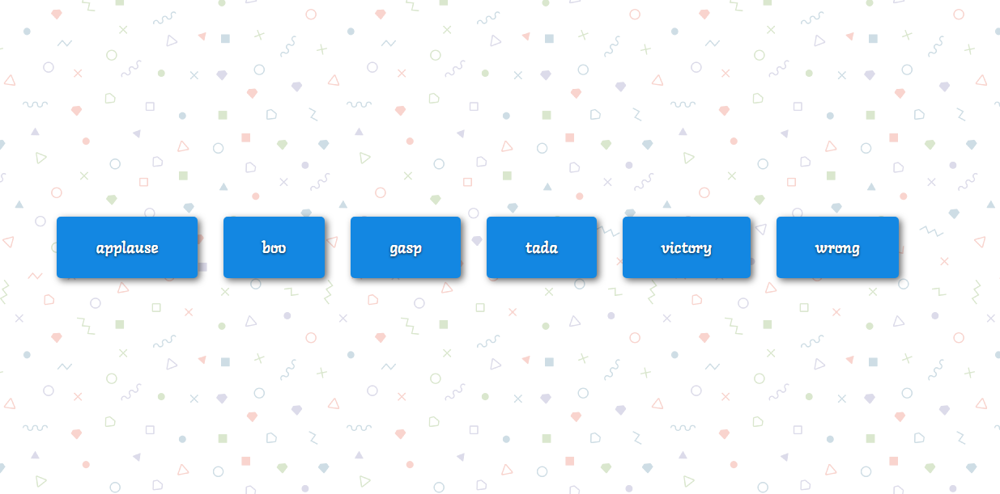

# Sound Board

> Sound Board App on Vanilla JS

### [Demo](http://sound-board-ab.surge.sh)
[](https://skr.sh/v5dFDaXse5F?a)

### Get started

```shell script
git clone
```
```shell script
open index.html
```
or
```shell script
npm i -g live-server
```
```shell script
live-server
```
